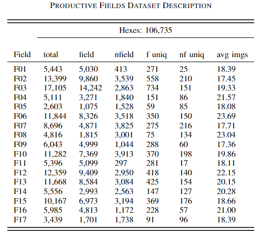
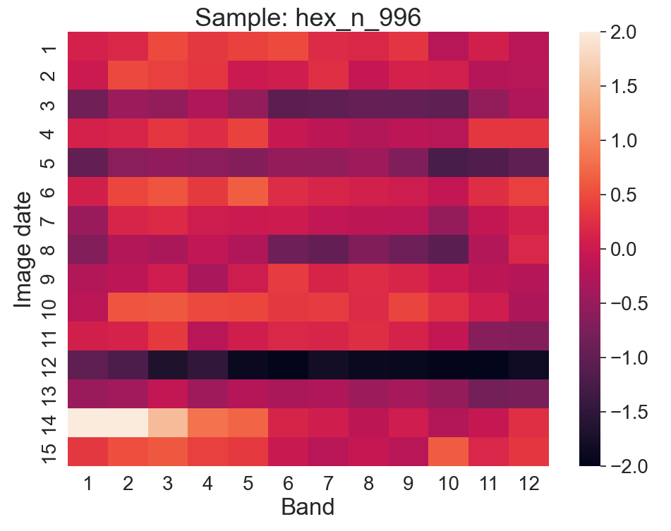

# Productive Crop Field Detection

This repository contains a project focused on detecting productive crop fields. The goal is to develop a model that can analyze satellite imagery and identify areas where crops are thriving, enabling farmers and agricultural organizations to make informed decisions about resource allocation and crop management.

## Table of Contents

- [Introduction](#introduction)
- [Dataset](#dataset)
- [Installation](#installation)
- [Usage](#usage)
- [Model Training](#model-training)
- [Evaluation](#evaluation)
- [Contributing](#contributing)
- [License](#license)

## Introduction

The productivity of crop fields plays a crucial role in the agricultural sector. By utilizing satellite imagery and machine learning techniques, this project aims to identify productive crop fields accurately. The developed model can help in monitoring the health and productivity of crops on a large scale, assisting farmers in making data-driven decisions.

## Dataset

The dataset used for this project consists of satellite imagery samples containing labeled crop field data. The dataset includes various satellite bands, such as near-infrared (NIR), red, green, and blue, which provide valuable information about the vegetation and presence of crops. The labeled data indicates the presence or absence of productive crop fields in the images. The dataset is indexed by L12 hexes supported by H3 library developed by Uber.

The dataset description containing the number of hexes and average image dates by field is represented in the image below.

The hexes are processed to create timeseries samples containing various image dates to cover most of the year and the diverse weather conditions as well as cloud covering. The representation of a timeseries sample where each row is an image date and each column a Sentinel-2 band is represented below.

## Installation

To set up the project locally, follow these steps:
- Install python 3.7 or above.
- Install Jupyter notebook.
- Run the notebook.

All packages should be installed at the start of the notebook.

## Usage
The notebook has a sample approach of how to load the dataset using Pandas, generate bidimensional timeseries samples and input them to the methods for training and validation.

## Model Training
Model training is also in the notebook. The selected models take in account the nature of the dataset which has very accurate positive labeled data plus inferred and less accurate negative labeled data.

## Evaluation
To evaluate the methods the authors used the most commonly used metrics in this field. We also focused in metrics for imbalanced data since there is in most of rural images a larger portion of field pixels compared to non-field pixels.

## Contributing

## License

## Documentation
This code is part of the research paper "Productive Crop Field Detection: A New Dataset and Deep Learning Benchmark Results". Link to be included here.

